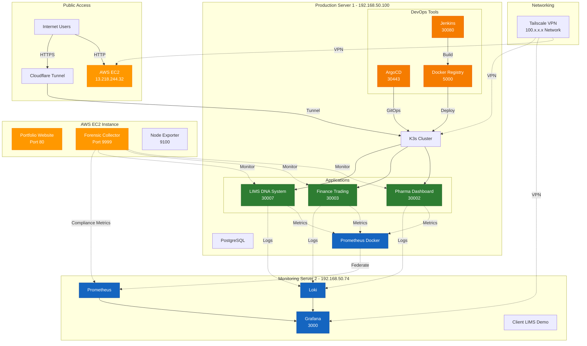
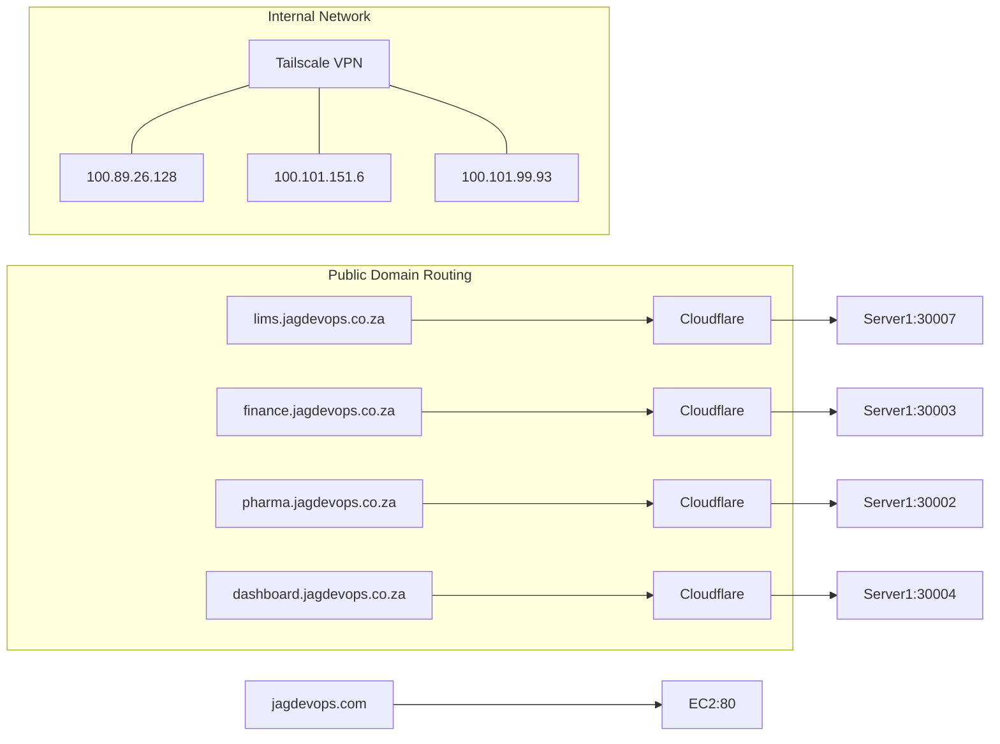
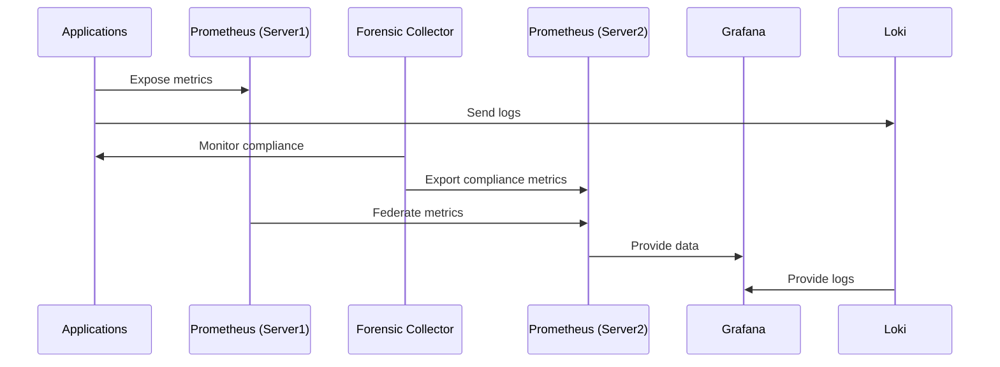

# Architecture Overview

## JAG DevOps Infrastructure - Complete Production Architecture

This repository documents the complete architecture of a production DevOps infrastructure supporting forensic LIMS, financial trading, and pharmaceutical compliance applications.

---

## 📋 Infrastructure Summary

A 3-server hybrid infrastructure combining on-premise servers with AWS EC2, running production applications with comprehensive monitoring and forensic-grade compliance tracking.

---

## 🏗️ Complete Architecture Diagram



---

## 🖥️ Server Details

### **Server 1: Production Kubernetes (192.168.50.100)**
- **Role**: Main production environment
- **Services**:
  - K3s Kubernetes cluster
  - LIMS application (DNA forensic tracking)
  - Finance application (Trading platform)
  - Pharma application (Inventory management)
  - Jenkins CI/CD
  - ArgoCD GitOps
  - Docker Registry
  - PostgreSQL databases
  - Prometheus (Docker container)

### **Server 2: Monitoring Hub (192.168.50.74)**
- **Role**: Centralized monitoring and observability
- **Services**:
  - Grafana (visualization)
  - Prometheus (metrics aggregation)
  - Loki (log aggregation)
  - Client LIMS demo instance

### **EC2 Instance: Public Gateway & Forensics (13.218.244.32)**
- **Role**: Public-facing services and forensic monitoring
- **Services**:
  - Portfolio website (jagdevops.com)
  - Forensic evidence collector
  - Node exporter
  - Compliance monitoring

---

## 🌐 Network Architecture



---

## 🔄 Deployment Pipelines

### **LIMS Pipeline**
```
GitHub → Jenkins → Docker Build → Registry → K3s Deployment
```

### **Finance/Pharma Pipeline**
```
GitHub → ArgoCD → Auto-sync → K3s Rolling Update
```

---

## 📊 Monitoring Flow



---

## 🔐 Security & Access

- **Public Access**: Via Cloudflare tunnels (HTTPS)
- **Internal Communication**: Tailscale VPN mesh
- **Service Mesh**: K3s internal networking
- **Authentication**: Grafana login, Jenkins auth, ArgoCD RBAC

---

## 📦 Applications Status

| Application | URL | Deployment Method | Replicas | Status |
|------------|-----|-------------------|----------|---------|
| LIMS | https://lims.jagdevops.co.za | Jenkins CI/CD | 1 | ✅ Operational |
| Finance | https://finance.jagdevops.co.za | ArgoCD GitOps | 2 | ✅ Operational |
| Pharma | https://pharma.jagdevops.co.za | ArgoCD GitOps | 2 | ✅ Operational |
| Dashboard | https://dashboard.jagdevops.co.za | Direct | 1 | ✅ Operational |
| Portfolio | https://jagdevops.com | Nginx | 1 | ✅ Operational |

---

## 🎯 Key Features

- **Zero-Downtime Deployments**: Rolling updates with health checks
- **GitOps**: Declarative infrastructure with ArgoCD
- **Forensic Monitoring**: DNA lab principles applied to DevOps
- **Multi-Environment**: Production, monitoring, and public-facing tiers
- **Compliance Tracking**: FDA 21 CFR Part 11, SOX, GMP standards

---

## 📂 Related Repositories

- [LIMS Application](https://github.com/GABRIELS562/JAG-LABSCIENTIFIC-DNA)
- [Zero-Downtime Pipeline](https://github.com/GABRIELS562/zero-downtime-pipeline)
- [Digital Evidence Pipeline](https://github.com/GABRIELS562/digital-evidence-pipeline)

---

## 👤 Author

**Gabriel S.**  
*DevOps Engineer | 15 Years Forensic Science Background*

---

*This architecture represents a production-grade DevOps infrastructure combining modern cloud-native practices with forensic-grade monitoring and compliance.*
