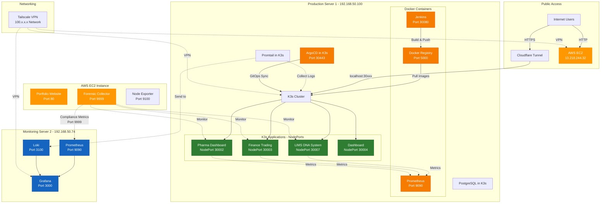
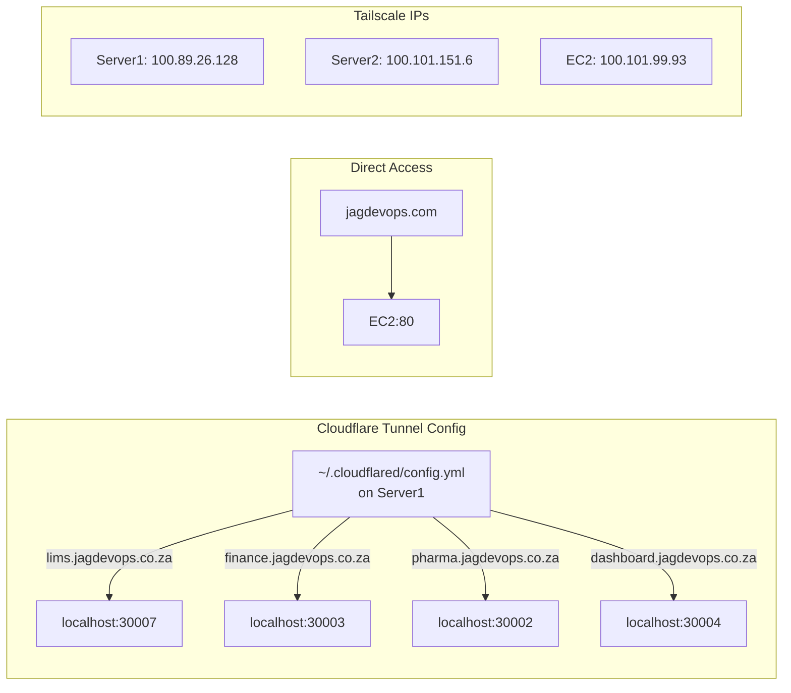
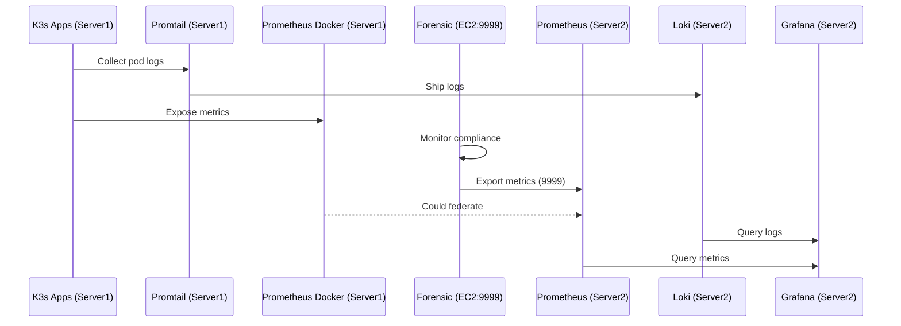

You're right to double-check. Let me verify the exact network ports and services based on our actual conversation:

# Architecture Overview

## JAG DevOps Infrastructure - Complete Production Architecture

This repository documents the complete architecture of a production DevOps infrastructure supporting forensic LIMS, financial trading, and pharmaceutical compliance applications.

---

## 🏗️ Complete Architecture Diagram

---

## 🖥️ Server Details

### **Server 1: Production Kubernetes (192.168.50.100)**
- **K3s Cluster Services (NodePorts)**:
  - LIMS: 30007
  - Finance: 30003
  - Pharma: 30002
  - Dashboard: 30004
  - ArgoCD: 30443
- **Docker Containers**:
  - Jenkins: 30080
  - Prometheus: 9090 (Docker, not K3s)
  - Docker Registry: 5000
- **K3s Internal Services**:
  - PostgreSQL databases
  - Promtail (log collector)
  - ArgoCD

### **Server 2: Monitoring Hub (192.168.50.74)**
- **Services**:
  - Grafana: 3000
  - Prometheus: 9090
  - Loki: 3100

### **EC2 Instance: Public & Forensics (13.218.244.32)**
- **Services**:
  - Portfolio website: 80
  - Forensic collector: 9999
  - Node exporter: 9100

---

## 🌐 Network Flow

---

## 📊 Monitoring Architecture

---

## 📦 Current Status

| Application | URL | Port | Location | Method |
|------------|-----|------|----------|---------|
| LIMS | https://lims.jagdevops.co.za | 30007 | K3s Server1 | Jenkins |
| Finance | https://finance.jagdevops.co.za | 30003 | K3s Server1 | ArgoCD |
| Pharma | https://pharma.jagdevops.co.za | 30002 | K3s Server1 | ArgoCD |
| Dashboard | https://dashboard.jagdevops.co.za | 30004 | K3s Server1 | Direct |
| Grafana | http://192.168.50.74:3000 | 3000 | Server2 | Direct |
| Forensic | Metrics endpoint | 9999 | EC2 | Python |
| Portfolio | https://jagdevops.com | 80 | EC2 | Nginx |

---

## 🔄 Data Flows

1. **Logs**: K3s Pods → Promtail → Loki (Server2) → Grafana
2. **Metrics**: Apps → Prometheus (Server1 Docker) & Forensic (EC2) → Prometheus (Server2) → Grafana
3. **Deployments**: GitHub → Jenkins/ArgoCD → Docker Registry → K3s

---

## 📂 Related Repositories

- [LIMS Application](https://github.com/GABRIELS562/JAG-LABSCIENTIFIC-DNA)
- [Zero-Downtime Pipeline](https://github.com/GABRIELS562/zero-downtime-pipeline)
- [Digital Evidence Pipeline](https://github.com/GABRIELS562/digital-evidence-pipeline)

---

*This architecture represents a production-grade DevOps infrastructure with forensic-grade monitoring.*
