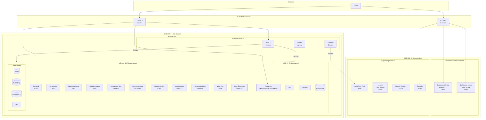
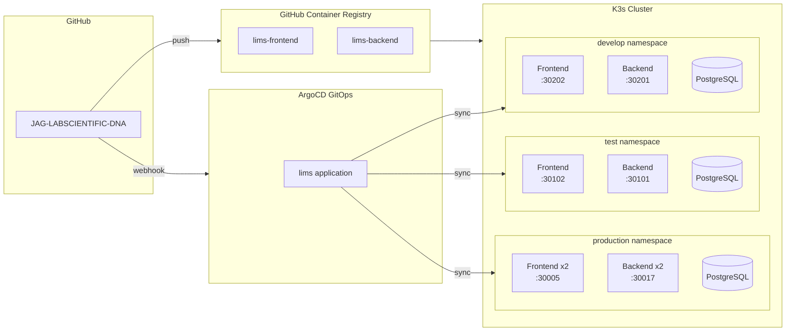
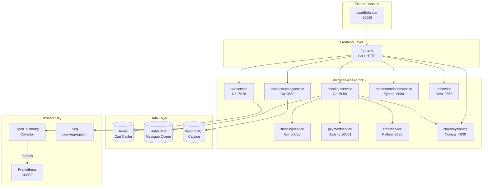
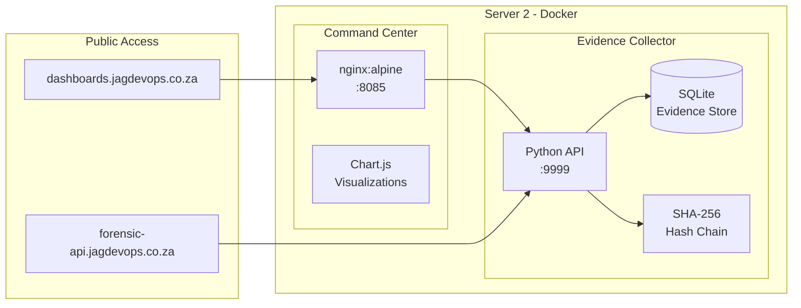
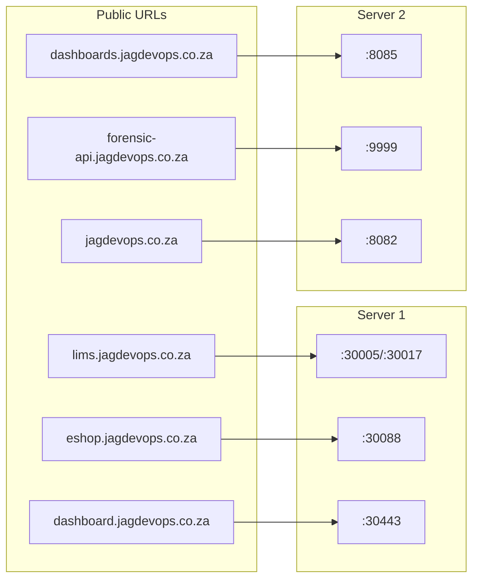
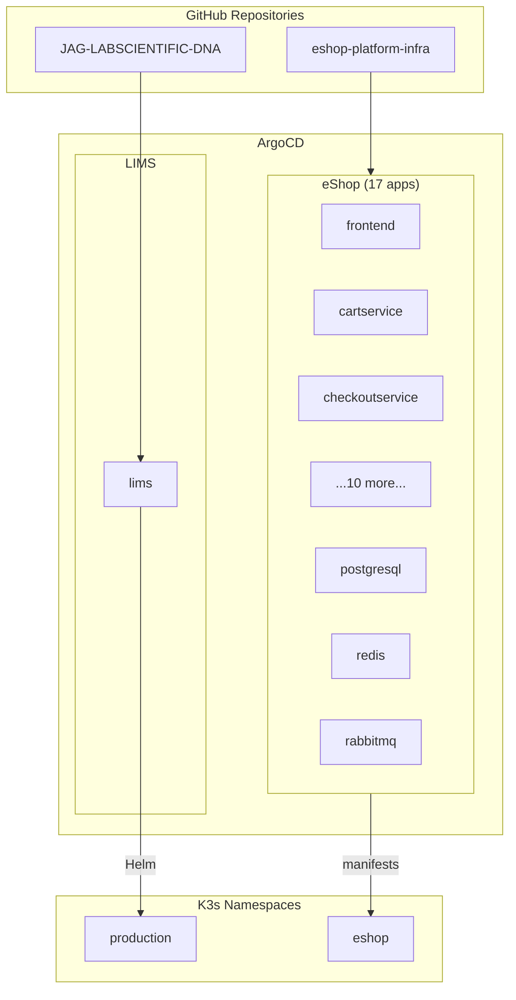
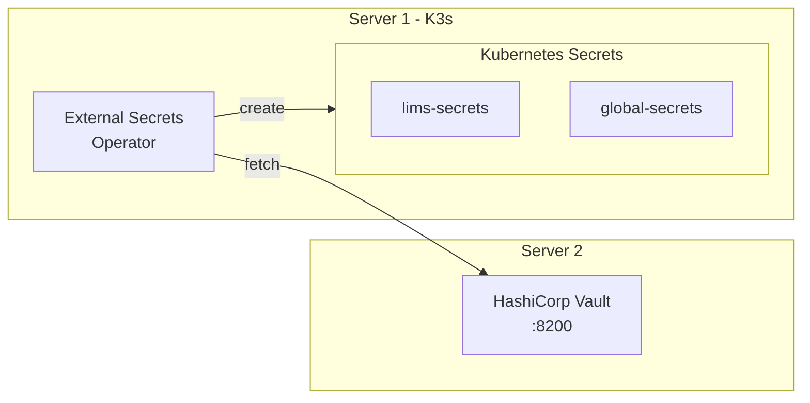

# JAG DevOps Infrastructure

Production-grade 2-server architecture running Kubernetes microservices with GitOps deployment.

## Architecture Overview

```mermaid
flowchart TB
    subgraph Internet["Internet"]
        Users["Users"]
    end

    subgraph Cloudflare["Cloudflare Tunnels"]
        CF1["Tunnel 1<br/>Server1"]
        CF2["Tunnel 2<br/>Server2"]
    end

    subgraph Server1["SERVER 1 - K3s Cluster"]
        subgraph K3s["K3s v1.33.4"]
            subgraph LIMS["LIMS (3 Environments)"]
                LIMS_PROD["Production<br/>2x Frontend + 2x Backend"]
                LIMS_TEST["Test"]
                LIMS_DEV["Develop"]
                PG_LIMS[("PostgreSQL")]
            end

            subgraph eShop["eShop - 14 Microservices"]
                FE["frontend<br/>(Go)"]
                CART["cartservice<br/>(C#)"]
                CHECKOUT["checkoutservice<br/>(Go)"]
                PRODUCT["productcatalog<br/>(Go)"]
                PAYMENT["paymentservice<br/>(Node.js)"]
                CURRENCY["currencyservice<br/>(Node.js)"]
                SHIPPING["shippingservice<br/>(Go)"]
                EMAIL["emailservice<br/>(Python)"]
                RECOMMEND["recommendation<br/>(Python)"]
                AD["adservice<br/>(Java)"]

                subgraph DataStores["Data Stores"]
                    REDIS[("Redis")]
                    RABBIT[("RabbitMQ")]
                    PG_SHOP[("PostgreSQL")]
                    SEQ["Seq"]
                end

                OTEL["OpenTelemetry<br/>Collector"]
            end

            subgraph Platform["Platform Services"]
                ARGO["ArgoCD<br/>18 Apps"]
                TRAEFIK["Traefik<br/>Ingress"]
                EXTSEC["External<br/>Secrets"]
            end
        end
    end

    subgraph Server2["SERVER 2 - Docker Host"]
        subgraph Forensic["Forensic Evidence Collector"]
            COLLECTOR["forensic-collector<br/>Python 3.11<br/>:9999"]
            DASHBOARD["dashboard-server<br/>nginx:alpine<br/>:8085"]
        end

        subgraph Support["Supporting Services"]
            VAULT["HashiCorp Vault<br/>:8200"]
            LOCUST["Locust<br/>Load Testing<br/>:8089"]
            REGISTRY["Docker Registry<br/>:5000"]
            PORTFOLIO["Portfolio<br/>:8082"]
        end
    end

    Users --> CF1 & CF2
    CF1 --> LIMS_PROD & FE & ARGO
    CF2 --> DASHBOARD & COLLECTOR & PORTFOLIO

    EXTSEC -.->|secrets| VAULT
    ARGO -->|GitOps| LIMS & eShop
```

## Server Details

### Server 1 - Kubernetes Production
| Spec | Value |
|------|-------|
| **OS** | Ubuntu 24.04.4 LTS |
| **Orchestration** | K3s v1.33.4 |
| **Namespaces** | 11 |
| **Tailscale IP** | 100.89.26.128 |

### Server 2 - Docker Host
| Spec | Value |
|------|-------|
| **OS** | Ubuntu 24.04.1 LTS |
| **Runtime** | Docker 28.4.0 |
| **Containers** | 13 |
| **Tailscale IP** | 100.101.151.6 |

---

## Projects

### 1. LIMS - Laboratory Information Management System

Full-stack DNA sample tracking system with 3 deployment environments.

```mermaid
flowchart LR
    subgraph GitHub["GitHub"]
        REPO["JAG-LABSCIENTIFIC-DNA"]
    end

    subgraph GHCR["GitHub Container Registry"]
        IMG_FE["lims-frontend"]
        IMG_BE["lims-backend"]
    end

    subgraph ArgoCD["ArgoCD GitOps"]
        APP["lims application"]
    end

    subgraph K3s["K3s Cluster"]
        subgraph prod["production namespace"]
            FE_P["Frontend x2<br/>:30005"]
            BE_P["Backend x2<br/>:30017"]
            DB_P[("PostgreSQL")]
        end
        subgraph test["test namespace"]
            FE_T["Frontend<br/>:30102"]
            BE_T["Backend<br/>:30101"]
            DB_T[("PostgreSQL")]
        end
        subgraph dev["develop namespace"]
            FE_D["Frontend<br/>:30202"]
            BE_D["Backend<br/>:30201"]
            DB_D[("PostgreSQL")]
        end
    end

    REPO -->|push| GHCR
    REPO -->|webhook| ArgoCD
    GHCR --> K3s
    APP -->|sync| prod & test & dev
```

| Environment | Frontend | Backend | Database | URL |
|-------------|----------|---------|----------|-----|
| **Production** | 2 replicas | 2 replicas | PostgreSQL | [lims.jagdevops.co.za](https://lims.jagdevops.co.za) |
| **Test** | 1 replica | 1 replica | PostgreSQL | Internal :30102 |
| **Develop** | 1 replica | 1 replica | PostgreSQL | Internal :30202 |

**Tech Stack:** React 18, Vite, Node.js, Express, PostgreSQL, Helm, ArgoCD

---

### 2. eShop - Cloud-Native Microservices Platform

14-service e-commerce platform demonstrating polyglot microservices architecture.

```mermaid
flowchart TB
    subgraph External["External Access"]
        LB["LoadBalancer<br/>:30088"]
    end

    subgraph Frontend["Frontend Layer"]
        FE["frontend<br/>Go + HTTP"]
    end

    subgraph Services["Microservices (gRPC)"]
        CART["cartservice<br/>C# :7070"]
        CHECKOUT["checkoutservice<br/>Go :5050"]
        PRODUCT["productcatalogservice<br/>Go :3550"]
        RECOMMEND["recommendationservice<br/>Python :8080"]
        SHIPPING["shippingservice<br/>Go :50051"]
        PAYMENT["paymentservice<br/>Node.js :50051"]
        EMAIL["emailservice<br/>Python :8080"]
        CURRENCY["currencyservice<br/>Node.js :7000"]
        AD["adservice<br/>Java :9555"]
    end

    subgraph Data["Data Layer"]
        REDIS[("Redis<br/>Cart Cache")]
        RABBIT[("RabbitMQ<br/>Message Queue")]
        PG[("PostgreSQL<br/>Catalog")]
    end

    subgraph Observability["Observability"]
        OTEL["OpenTelemetry<br/>Collector"]
        SEQ["Seq<br/>Log Aggregation"]
        PROM["Prometheus<br/>:30889"]
    end

    LB --> FE
    FE --> CART & CHECKOUT & PRODUCT & RECOMMEND & AD & CURRENCY
    CHECKOUT --> SHIPPING & PAYMENT & EMAIL & CURRENCY
    CART --> REDIS
    CHECKOUT --> RABBIT
    PRODUCT --> PG

    Services -->|traces| OTEL
    OTEL -->|metrics| PROM
    Services -->|logs| SEQ
```

| Service | Language | Port | Protocol |
|---------|----------|------|----------|
| frontend | Go | 8080 | HTTP |
| cartservice | C# | 7070 | gRPC |
| checkoutservice | Go | 5050 | gRPC |
| productcatalogservice | Go | 3550 | gRPC |
| paymentservice | Node.js | 50051 | gRPC |
| currencyservice | Node.js | 7000 | gRPC |
| shippingservice | Go | 50051 | gRPC |
| emailservice | Python | 8080 | gRPC |
| recommendationservice | Python | 8080 | gRPC |
| adservice | Java | 9555 | gRPC |

**URL:** [eshop.jagdevops.co.za](https://eshop.jagdevops.co.za)

**GitOps:** ArgoCD syncing from [eshop-platform-infra](https://github.com/GABRIELS562/eshop-platform-infra)

---

### 3. Forensic Evidence Collector

Compliance automation platform with tamper-evident audit trails and real-time monitoring dashboard.

```mermaid
flowchart LR
    subgraph Server2["Server 2 - Docker"]
        subgraph Collector["Evidence Collector"]
            API["Python API<br/>:9999"]
            DB[("SQLite<br/>Evidence Store")]
            HASH["SHA-256<br/>Hash Chain"]
        end

        subgraph Dashboard["Command Center"]
            NGINX["nginx:alpine<br/>:8085"]
            CHARTS["Chart.js<br/>Visualizations"]
        end

        API --> DB
        API --> HASH
        NGINX --> API
    end

    subgraph Cloudflare["Public Access"]
        URL1["dashboards.jagdevops.co.za"]
        URL2["forensic-api.jagdevops.co.za"]
    end

    URL1 --> NGINX
    URL2 --> API
```

| Component | Technology | Port | URL |
|-----------|------------|------|-----|
| **Collector API** | Python 3.11 | 9999 | [forensic-api.jagdevops.co.za](https://forensic-api.jagdevops.co.za) |
| **Dashboard** | nginx + Chart.js | 8085 | [dashboards.jagdevops.co.za](https://dashboards.jagdevops.co.za) |

**Features:**
- SHA-256 blockchain-style hash chains for evidence integrity
- Real-time metrics via Prometheus endpoint
- Command Center dashboard with Chart.js visualizations

---

## Network & URLs

### Public Endpoints (Cloudflare Tunnels)

```mermaid
flowchart LR
    subgraph Public["Public URLs"]
        L["lims.jagdevops.co.za"]
        E["eshop.jagdevops.co.za"]
        D["dashboards.jagdevops.co.za"]
        F["forensic-api.jagdevops.co.za"]
        A["dashboard.jagdevops.co.za"]
        P["jagdevops.co.za"]
    end

    subgraph Server1["Server 1"]
        L1[":30005/:30017"]
        E1[":30088"]
        A1[":30443"]
    end

    subgraph Server2["Server 2"]
        D2[":8085"]
        F2[":9999"]
        P2[":8082"]
    end

    L --> L1
    E --> E1
    A --> A1
    D --> D2
    F --> F2
    P --> P2
```

| URL | Service | Server | Port |
|-----|---------|--------|------|
| lims.jagdevops.co.za | LIMS Production | Server1 | 30005/30017 |
| eshop.jagdevops.co.za | eShop Frontend | Server1 | 30088 |
| dashboard.jagdevops.co.za | ArgoCD | Server1 | 30443 |
| dashboards.jagdevops.co.za | Forensic Dashboard | Server2 | 8085 |
| forensic-api.jagdevops.co.za | Forensic API | Server2 | 9999 |
| jagdevops.co.za | Portfolio | Server2 | 8082 |

---

## GitOps & CI/CD

### ArgoCD Applications (18 total)

```mermaid
flowchart TB
    subgraph GitHub["GitHub Repositories"]
        R1["JAG-LABSCIENTIFIC-DNA"]
        R2["eshop-platform-infra"]
    end

    subgraph ArgoCD["ArgoCD"]
        subgraph LIMS_Apps["LIMS"]
            A1["lims"]
        end
        subgraph eShop_Apps["eShop (17 apps)"]
            A2["frontend"]
            A3["cartservice"]
            A4["checkoutservice"]
            A5["...10 more..."]
            A6["postgresql"]
            A7["redis"]
            A8["rabbitmq"]
        end
    end

    subgraph K3s["K3s Namespaces"]
        N1["production"]
        N2["eshop"]
    end

    R1 --> A1
    R2 --> eShop_Apps
    A1 -->|Helm| N1
    eShop_Apps -->|manifests| N2
```

### Secrets Management

```mermaid
flowchart LR
    subgraph Server2["Server 2"]
        VAULT["HashiCorp Vault<br/>:8200"]
    end

    subgraph Server1["Server 1 - K3s"]
        ESO["External Secrets<br/>Operator"]
        subgraph Secrets["Kubernetes Secrets"]
            S1["lims-secrets"]
            S2["global-secrets"]
        end
    end

    ESO -->|fetch| VAULT
    ESO -->|create| Secrets
```

---

## Supporting Infrastructure

### Server 2 Services

| Container | Image | Port | Purpose |
|-----------|-------|------|---------|
| portfolio-vault | hashicorp/vault:1.15 | 8200 | Secrets management |
| locust-master | locustio/locust:2.20.0 | 8089 | Load testing |
| locust-worker-1 | locustio/locust:2.20.0 | - | Load worker |
| locust-worker-2 | locustio/locust:2.20.0 | - | Load worker |
| locust-exporter | locust_exporter:v0.5.0 | 9646 | Prometheus metrics |
| registry | registry:2 | 5000 | Private Docker registry |
| portainer_agent | portainer/agent | 9001 | Container management |

---

## Repositories

| Project | Repository | Description |
|---------|------------|-------------|
| LIMS | [JAG-LABSCIENTIFIC-DNA](https://github.com/GABRIELS562/JAG-LABSCIENTIFIC-DNA) | Full-stack lab management system |
| eShop Infra | [eshop-platform-infra](https://github.com/GABRIELS562/eshop-platform-infra) | Kubernetes manifests for microservices |
| Forensic | [digital-evidence-pipeline](https://github.com/GABRIELS562/digital-evidence-pipeline) | Evidence collector + dashboard |
| Portfolio | [JAIME-GABRIELS-PORTFOLIO-WEBSITE](https://github.com/GABRIELS562/JAIME-GABRIELS-PORTFOLIO-WEBSITE) | This portfolio site |
| Architecture | [Architecture-](https://github.com/GABRIELS562/Architecture-) | This documentation |

---

## Author

**Jaime Gabriels**
DevOps Engineer

[Portfolio](https://jagdevops.co.za) | [LinkedIn](https://linkedin.com/in/jaime-gabriels-643132386) | [GitHub](https://github.com/GABRIELS562)

---

*2-Server production infrastructure with GitOps deployment, microservices architecture, and comprehensive observability*
