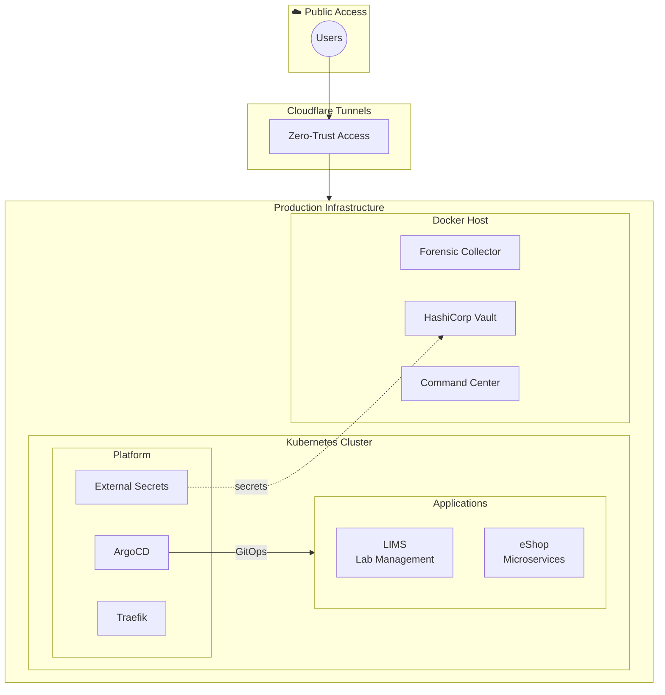
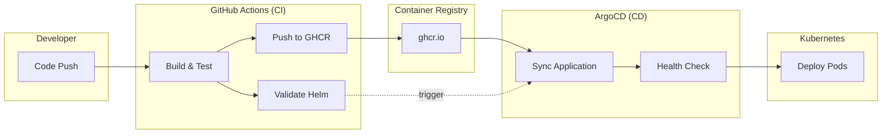
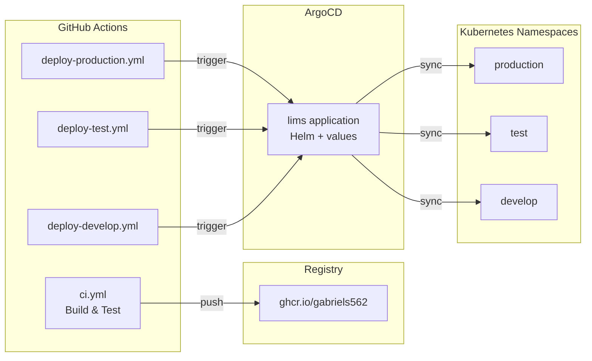
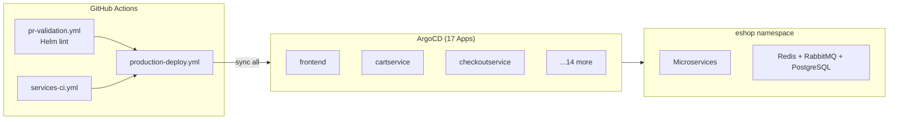
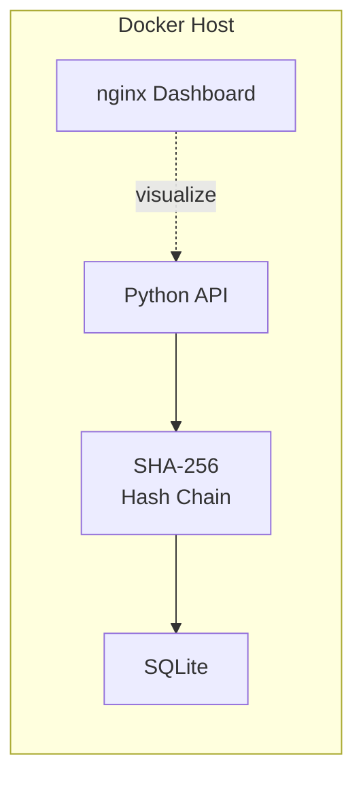

# Infrastructure Architecture

Production-grade DevOps infrastructure showcasing Kubernetes orchestration, GitOps deployment, and microservices architecture.

[](https://k3s.io/)
[](https://github.com/features/actions)
[](https://argoproj.github.io/cd/)
[](https://docker.com/)

---

## Architecture Overview


```mermaid
flowchart TB
    subgraph Internet["☁️ Public Access"]
        Users(("Users"))
    end

    subgraph CDN["Cloudflare Tunnels"]
        CF["Zero-Trust Access"]
    end

    subgraph Infra["Production Infrastructure"]
        subgraph S1["Kubernetes Cluster"]
            direction TB
            subgraph Apps["Applications"]
                LIMS["LIMS<br/>Lab Management"]
                ESHOP["eShop<br/>Microservices"]
            end
            subgraph Platform["Platform"]
                ARGO["ArgoCD"]
                TRAEFIK["Traefik"]
                ESO["External Secrets"]
            end
        end

        subgraph S2["Docker Host"]
            direction TB
            FORENSIC["Forensic Collector"]
            DASHBOARD["Command Center"]
            VAULT["HashiCorp Vault"]
        end
    end

    Users --> CF --> Infra
    ESO -.->|secrets| VAULT
    ARGO -->|GitOps| Apps
```

---

## CI/CD Pipeline

Full GitOps workflow using **GitHub Actions** for CI and **ArgoCD** for CD.


```mermaid
flowchart LR
    subgraph Developer
        CODE["Code Push"]
    end

    subgraph GHA["GitHub Actions (CI)"]
        BUILD["Build & Test"]
        PUSH["Push to GHCR"]
        VALIDATE["Validate Helm"]
    end

    subgraph Registry["Container Registry"]
        GHCR["ghcr.io"]
    end

    subgraph ARGO["ArgoCD (CD)"]
        SYNC["Sync Application"]
        HEALTH["Health Check"]
    end

    subgraph K8s["Kubernetes"]
        DEPLOY["Deploy Pods"]
    end

    CODE --> BUILD --> PUSH --> GHCR
    BUILD --> VALIDATE
    GHCR --> SYNC --> HEALTH --> DEPLOY
    VALIDATE -.->|trigger| SYNC
```

### Pipeline by Project

| Project | CI (GitHub Actions) | CD (ArgoCD) | Environments |
|---------|---------------------|-------------|--------------|
| **LIMS** | Build, Push to GHCR, Smoke Tests | Helm sync, Health checks | Production, Test, Develop |
| **eShop** | Validate Helm, PR checks | Sync 17 applications | Production |
| **Forensic** | — | — | Docker (manual) |

---

## Projects

### 1. LIMS - Laboratory Information Management System

Full-stack DNA sample tracking system with multi-environment deployment.


```mermaid
flowchart LR
    subgraph CI["GitHub Actions"]
        BUILD["ci.yml<br/>Build & Test"]
        DEPLOY_P["deploy-production.yml"]
        DEPLOY_T["deploy-test.yml"]
        DEPLOY_D["deploy-develop.yml"]
    end

    subgraph Registry
        GHCR["ghcr.io/gabriels562"]
    end

    subgraph CD["ArgoCD"]
        APP["lims application<br/>Helm + values"]
    end

    subgraph K8s["Kubernetes Namespaces"]
        PROD["production"]
        TEST["test"]
        DEV["develop"]
    end

    BUILD -->|push| GHCR
    DEPLOY_P & DEPLOY_T & DEPLOY_D -->|trigger| APP
    APP -->|sync| PROD & TEST & DEV
```

**Workflows (6):**
- `ci.yml` — Build, test, push images to GHCR
- `deploy-production.yml` — Production deployment + smoke tests
- `deploy-test.yml` — Test environment deployment
- `deploy-develop.yml` — Development environment deployment
- `cleanup.yml` — Resource cleanup
- `load-test.yml` — Locust load testing

| Component | Technology |
|-----------|------------|
| Frontend | React 18, Vite |
| Backend | Node.js, Express |
| Database | PostgreSQL |
| Deployment | Helm, ArgoCD |

**Live:** [lims.jagdevops.co.za](https://lims.jagdevops.co.za)

**Repository:** [JAG-LABSCIENTIFIC-DNA](https://github.com/GABRIELS562/JAG-LABSCIENTIFIC-DNA)

---

### 2. eShop - Cloud-Native Microservices

Polyglot microservices e-commerce platform with 17 ArgoCD-managed applications.


```mermaid
flowchart LR
    subgraph CI["GitHub Actions"]
        VAL["pr-validation.yml<br/>Helm lint"]
        SVC["services-ci.yml"]
        PROD["production-deploy.yml"]
    end

    subgraph CD["ArgoCD (17 Apps)"]
        direction TB
        FE["frontend"]
        CART["cartservice"]
        CHECK["checkoutservice"]
        MORE["...14 more"]
    end

    subgraph K8s["eshop namespace"]
        PODS["Microservices"]
        DATA["Redis + RabbitMQ + PostgreSQL"]
    end

    VAL & SVC --> PROD -->|sync all| CD --> K8s
```

**Workflows (5):**
- `pr-validation.yml` — Helm lint and template validation
- `services-ci.yml` — Service-level CI
- `production-deploy.yml` — ArgoCD sync trigger
- `develop-ci.yml` — Development CI
- `reusable-build.yml` — Shared build workflow

**ArgoCD Applications (17):**
| Services | Infrastructure |
|----------|----------------|
| frontend, cartservice, checkoutservice | postgresql, redis, redis-cart |
| productcatalogservice, currencyservice | rabbitmq, seq |
| shippingservice, paymentservice | otel-collector, loadgenerator |
| emailservice, recommendationservice, adservice | |

| Layer | Technologies |
|-------|--------------|
| Services | Go, C#, Node.js, Python, Java |
| Communication | gRPC, Protocol Buffers |
| Data | Redis, RabbitMQ, PostgreSQL |
| Observability | OpenTelemetry, Prometheus |

**Live:** [eshop.jagdevops.co.za](https://eshop.jagdevops.co.za)

**Repository:** [eshop-platform-infra](https://github.com/GABRIELS562/eshop-platform-infra)

---

### 3. Forensic Evidence Collector

Compliance automation platform with tamper-evident audit trails. Deployed via Docker on Server 2.


```mermaid
flowchart LR
    subgraph Server2["Docker Host"]
        API["Python API"]
        HASH["SHA-256<br/>Hash Chain"]
        DB["SQLite"]
        DASH["nginx Dashboard"]
    end

    API --> HASH --> DB
    DASH -.->|visualize| API
```

| Component | Technology |
|-----------|------------|
| Collector | Python 3.11 |
| Integrity | SHA-256 hash chains |
| Dashboard | Chart.js, nginx |
| Metrics | Prometheus-compatible |

**Live:** [dashboards.jagdevops.co.za](https://dashboards.jagdevops.co.za)

**Repository:** [forensic-evidence-collector](https://github.com/GABRIELS562/forensic-evidence-collector)

---

## Technology Stack

### CI/CD


### Orchestration


### Infrastructure & Security


### Observability


### Languages


### Data & Messaging


---

## DevOps Practices

| Practice | Implementation |
|----------|----------------|
| **CI** | GitHub Actions — build, test, push images |
| **CD** | ArgoCD — GitOps sync with self-healing |
| **Secrets** | HashiCorp Vault + External Secrets Operator |
| **Networking** | Cloudflare Tunnels (zero-trust) |
| **Multi-Environment** | Production, Test, Develop namespaces |
| **Observability** | OpenTelemetry + Prometheus |
| **Load Testing** | Locust distributed testing |

---

## Monitoring & Observability

```
┌─────────────────────────────────────────────────────────────────┐
│                    OBSERVABILITY STACK                          │
├─────────────────────────────────────────────────────────────────┤
│                                                                 │
│  ┌─────────────┐    ┌─────────────┐    ┌─────────────┐         │
│  │   eShop     │    │    LIMS     │    │  Forensic   │         │
│  │ Services    │    │   App       │    │  Collector  │         │
│  └──────┬──────┘    └──────┬──────┘    └──────┬──────┘         │
│         │                  │                  │                 │
│         ▼                  ▼                  ▼                 │
│  ┌─────────────────────────────────────────────────────┐       │
│  │              OpenTelemetry Collector                │       │
│  │         (traces, metrics, logs)                     │       │
│  └──────────────────────┬──────────────────────────────┘       │
│                         │                                       │
│         ┌───────────────┼───────────────┐                      │
│         ▼               ▼               ▼                      │
│  ┌───────────┐   ┌───────────┐   ┌───────────┐                │
│  │Prometheus │   │   Seq     │   │   Loki    │                │
│  │ (metrics) │   │  (logs)   │   │  (logs)   │                │
│  └───────────┘   └───────────┘   └───────────┘                │
│                                                                 │
└─────────────────────────────────────────────────────────────────┘
```

| Component | Purpose | Project |
|-----------|---------|---------|
| **OpenTelemetry** | Distributed tracing & metrics | eShop |
| **Prometheus** | Metrics collection & alerting | All |
| **Seq** | Structured log aggregation | eShop |
| **Locust** | Load testing with exporters | LIMS |
| **Health Checks** | Kubernetes probes | All |

---

## Repositories

| Project | Description | Link |
|---------|-------------|------|
| **LIMS** | Lab management system | [View →](https://github.com/GABRIELS562/JAG-LABSCIENTIFIC-DNA) |
| **eShop Infrastructure** | Kubernetes manifests | [View →](https://github.com/GABRIELS562/eshop-platform-infra) |
| **Forensic Collector** | Evidence automation | [View →](https://github.com/GABRIELS562/forensic-evidence-collector) |
| **Portfolio** | Personal website | [View →](https://github.com/GABRIELS562/JAIME-GABRIELS-PORTFOLIO-WEBSITE) |

---

## Author

**Jaime Gabriels** — DevOps Engineer

[](https://jagdevops.co.za)
[](https://linkedin.com/in/jaime-gabriels-643132386)
[](https://github.com/GABRIELS562)
