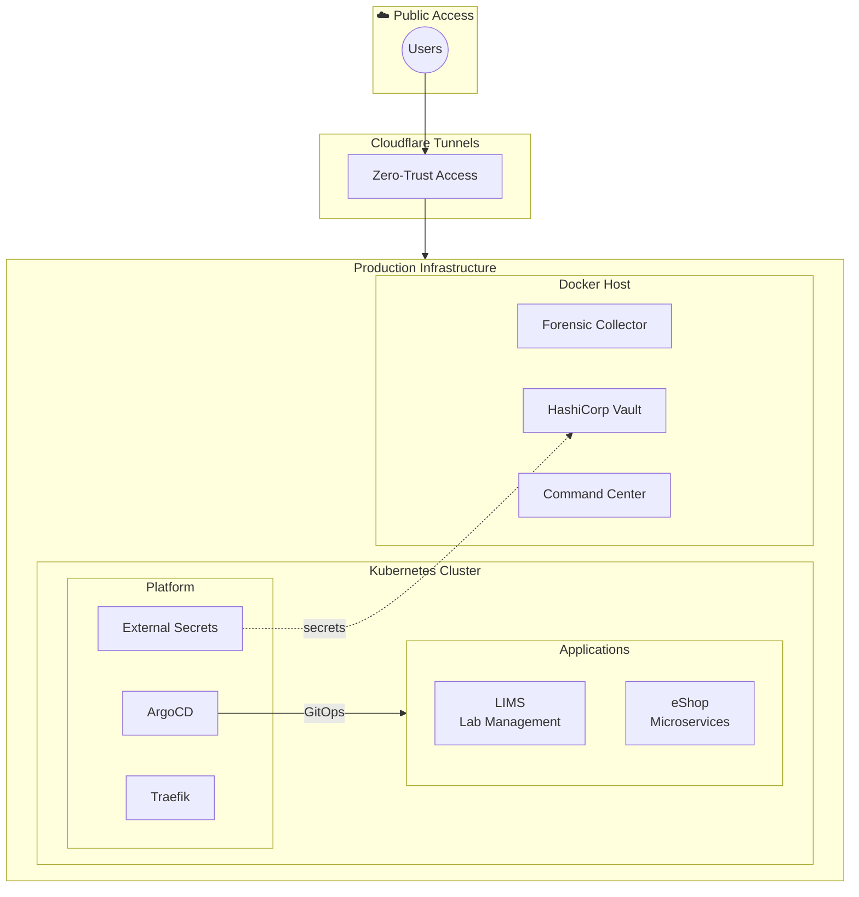
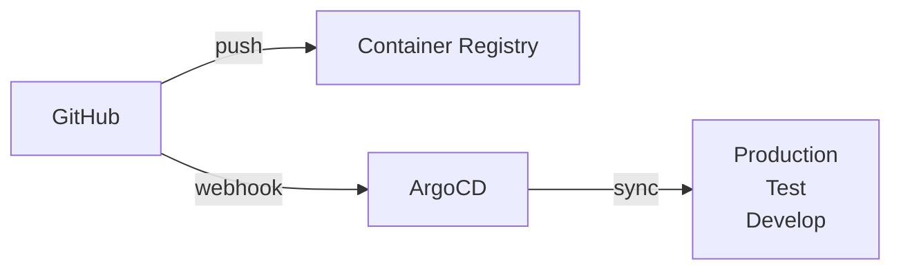
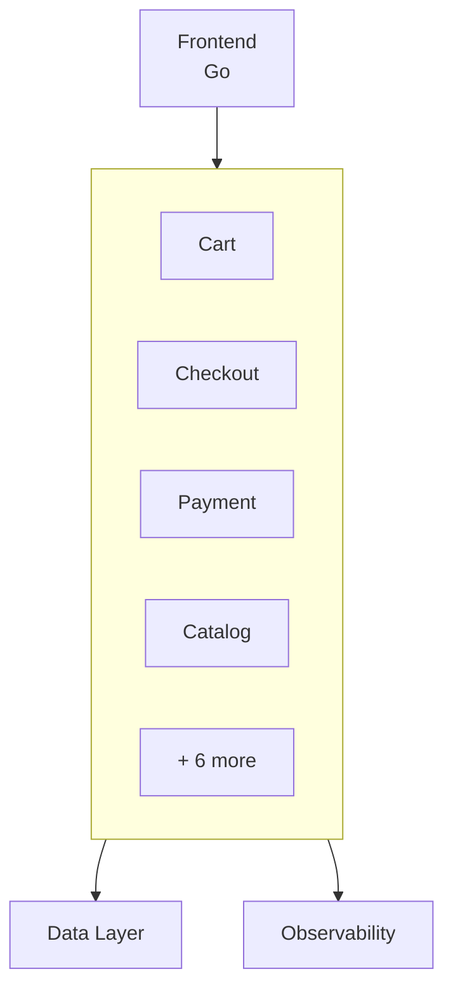
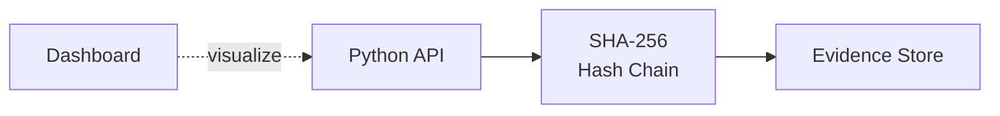

# Infrastructure Architecture

Production-grade DevOps infrastructure showcasing Kubernetes orchestration, GitOps deployment, and microservices architecture.

---

## Architecture Overview

```mermaid
flowchart TB
    subgraph Internet["☁️ Public Access"]
        Users(("Users"))
    end

    subgraph CDN["Cloudflare Tunnels"]
        CF["Zero-Trust Access"]
    end

    subgraph Infra["Production Infrastructure"]
        subgraph S1["Kubernetes Cluster"]
            direction TB
            subgraph Apps["Applications"]
                LIMS["LIMS<br/>Lab Management"]
                ESHOP["eShop<br/>Microservices"]
            end
            subgraph Platform["Platform"]
                ARGO["ArgoCD"]
                TRAEFIK["Traefik"]
                ESO["External Secrets"]
            end
        end

        subgraph S2["Docker Host"]
            direction TB
            FORENSIC["Forensic Collector"]
            DASHBOARD["Command Center"]
            VAULT["HashiCorp Vault"]
        end
    end

    Users --> CF --> Infra
    ESO -.->|secrets| VAULT
    ARGO -->|GitOps| Apps
```

---

## Projects

### 1. LIMS - Laboratory Information Management System

Full-stack DNA sample tracking system with multi-environment deployment.

```mermaid
flowchart LR
    GH["GitHub"] -->|push| GHCR["Container Registry"]
    GH -->|webhook| ARGO["ArgoCD"]
    ARGO -->|sync| ENV["Production<br/>Test<br/>Develop"]
```

| Component | Technology |
|-----------|------------|
| Frontend | React 18, Vite |
| Backend | Node.js, Express |
| Database | PostgreSQL |
| Deployment | Helm, ArgoCD |

**Live:** [lims.jagdevops.co.za](https://lims.jagdevops.co.za)

**Repository:** [JAG-LABSCIENTIFIC-DNA](https://github.com/GABRIELS562/JAG-LABSCIENTIFIC-DNA)

---

### 2. eShop - Cloud-Native Microservices

Polyglot microservices e-commerce platform demonstrating distributed systems patterns.

```mermaid
flowchart TB
    FE["Frontend<br/>Go"] --> SVC["Business Services<br/>gRPC"]
    SVC --> DATA["Data Layer"]
    SVC --> OBS["Observability"]

    subgraph SVC[" "]
        direction LR
        S1["Cart"]
        S2["Checkout"]
        S3["Payment"]
        S4["Catalog"]
        S5["+ 6 more"]
    end
```

| Layer | Technologies |
|-------|--------------|
| Services | Go, C#, Node.js, Python, Java |
| Communication | gRPC, Protocol Buffers |
| Data | Redis, RabbitMQ, PostgreSQL |
| Observability | OpenTelemetry, Prometheus |

**Live:** [eshop.jagdevops.co.za](https://eshop.jagdevops.co.za)

**Repository:** [eshop-platform-infra](https://github.com/GABRIELS562/eshop-platform-infra)

---

### 3. Forensic Evidence Collector

Compliance automation platform with tamper-evident audit trails.

```mermaid
flowchart LR
    API["Python API"] --> HASH["SHA-256<br/>Hash Chain"]
    HASH --> DB["Evidence Store"]
    DASH["Dashboard"] -.->|visualize| API
```

| Component | Technology |
|-----------|------------|
| Collector | Python 3.11 |
| Integrity | SHA-256 hash chains |
| Dashboard | Chart.js, nginx |
| Metrics | Prometheus-compatible |

**Live:** [dashboards.jagdevops.co.za](https://dashboards.jagdevops.co.za)

**Repository:** [digital-evidence-pipeline](https://github.com/GABRIELS562/digital-evidence-pipeline)

---

## Technology Stack

### Orchestration & Deployment

### Infrastructure & Security

### Observability

### Languages & Frameworks

### Data & Messaging

---

## DevOps Practices

| Practice | Implementation |
|----------|----------------|
| **GitOps** | ArgoCD with automated sync and self-healing |
| **CI/CD** | GitHub Actions → Container Registry → K8s |
| **Secrets Management** | HashiCorp Vault + External Secrets Operator |
| **Zero-Trust Networking** | Cloudflare Tunnels (no exposed ports) |
| **Multi-Environment** | Production, Test, Develop namespaces |
| **Observability** | OpenTelemetry traces + Prometheus metrics |
| **Load Testing** | Locust distributed testing |

---

## Repositories

| Project | Description | Link |
|---------|-------------|------|
| **LIMS** | Lab management system | [View →](https://github.com/GABRIELS562/JAG-LABSCIENTIFIC-DNA) |
| **eShop Infrastructure** | Kubernetes manifests | [View →](https://github.com/GABRIELS562/eshop-platform-infra) |
| **Forensic Collector** | Evidence automation | [View →](https://github.com/GABRIELS562/digital-evidence-pipeline) |
| **Portfolio** | Personal website | [View →](https://github.com/GABRIELS562/JAIME-GABRIELS-PORTFOLIO-WEBSITE) |

---

## Author

**Jaime Gabriels** — DevOps Engineer

