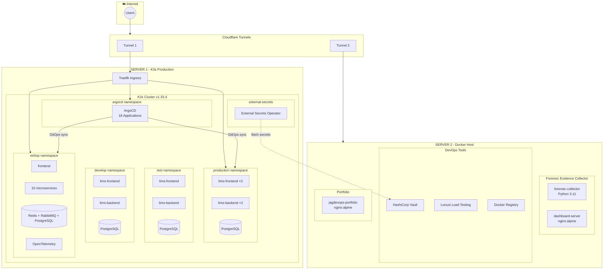
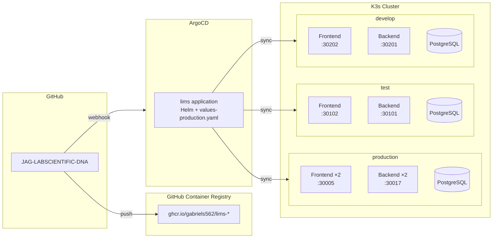
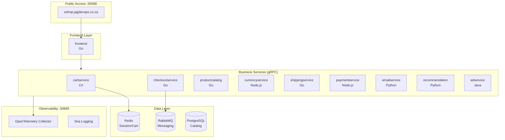
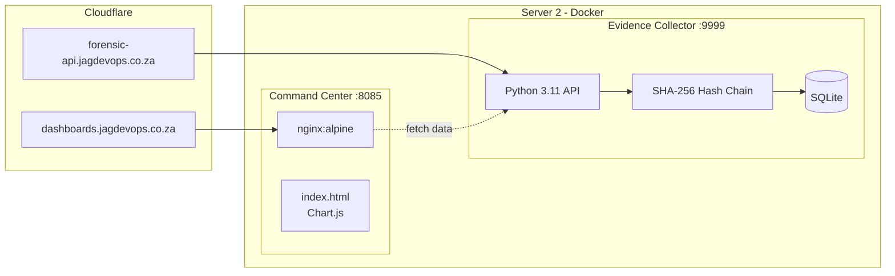
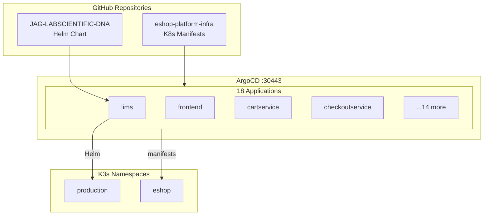
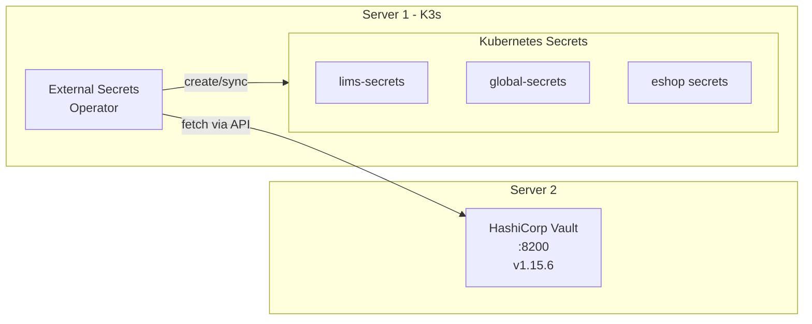
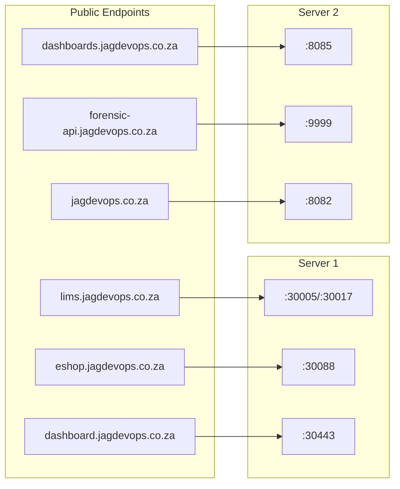

# JAG DevOps Infrastructure

**2-Server Production Architecture** | K3s Kubernetes | GitOps | Microservices

---

## Infrastructure Overview

```mermaid
flowchart TB
    subgraph Internet["☁️ Internet"]
        Users(("Users"))
    end

    subgraph CF["Cloudflare Tunnels"]
        T1["Tunnel 1"]
        T2["Tunnel 2"]
    end

    subgraph S1["SERVER 1 - K3s Production"]
        direction TB
        subgraph K3s["K3s Cluster v1.33.4"]
            subgraph NS_PROD["production namespace"]
                LIMS_FE["lims-frontend ×2"]
                LIMS_BE["lims-backend ×2"]
                LIMS_DB[("PostgreSQL")]
            end
            subgraph NS_TEST["test namespace"]
                TEST_FE["lims-frontend"]
                TEST_BE["lims-backend"]
                TEST_DB[("PostgreSQL")]
            end
            subgraph NS_DEV["develop namespace"]
                DEV_FE["lims-frontend"]
                DEV_BE["lims-backend"]
                DEV_DB[("PostgreSQL")]
            end
            subgraph NS_ESHOP["eshop namespace"]
                ESHOP_FE["frontend"]
                ESHOP_SVC["10 microservices"]
                ESHOP_DATA[("Redis + RabbitMQ + PostgreSQL")]
                OTEL["OpenTelemetry"]
            end
            subgraph NS_ARGO["argocd namespace"]
                ARGOCD["ArgoCD<br/>18 Applications"]
            end
            subgraph NS_EXT["external-secrets"]
                ESO["External Secrets Operator"]
            end
        end
        TRAEFIK["Traefik Ingress"]
    end

    subgraph S2["SERVER 2 - Docker Host"]
        direction TB
        subgraph Forensic["Forensic Evidence Collector"]
            COLLECTOR["forensic-collector<br/>Python 3.11"]
            DASHBOARD["dashboard-server<br/>nginx:alpine"]
        end
        subgraph DevOps["DevOps Tools"]
            VAULT["HashiCorp Vault"]
            LOCUST["Locust Load Testing"]
            REGISTRY["Docker Registry"]
        end
        subgraph Portfolio["Portfolio"]
            SITE["jagdevops-portfolio<br/>nginx:alpine"]
        end
    end

    Users --> CF
    T1 --> TRAEFIK
    T2 --> S2
    TRAEFIK --> NS_PROD & NS_ESHOP & NS_ARGO
    ESO -.->|fetch secrets| VAULT
    ARGOCD -->|GitOps sync| NS_PROD & NS_ESHOP
```

---

## Server Specifications

| | **Server 1** | **Server 2** |
|---|---|---|
| **Role** | K3s Production Cluster | Docker Host |
| **OS** | Ubuntu 24.04.4 LTS | Ubuntu 24.04.1 LTS |
| **Orchestration** | K3s v1.33.4 | Docker 28.4.0 |
| **RAM** | 7.6 GB | 7.6 GB |
| **Storage** | 233 GB (42% used) | 234 GB (30% used) |
| **Namespaces/Containers** | 11 namespaces | 13 containers |

---

## Project 1: LIMS - Laboratory Information Management System

Full-stack DNA sample tracking system deployed across 3 Kubernetes environments.

```mermaid
flowchart LR
    subgraph GH["GitHub"]
        REPO["JAG-LABSCIENTIFIC-DNA"]
    end

    subgraph GHCR["GitHub Container Registry"]
        IMG["ghcr.io/gabriels562/lims-*"]
    end

    subgraph ARGO["ArgoCD"]
        APP["lims application<br/>Helm + values-production.yaml"]
    end

    subgraph K3s["K3s Cluster"]
        subgraph P["production"]
            P_FE["Frontend ×2<br/>:30005"]
            P_BE["Backend ×2<br/>:30017"]
            P_DB[("PostgreSQL")]
        end
        subgraph T["test"]
            T_FE["Frontend<br/>:30102"]
            T_BE["Backend<br/>:30101"]
            T_DB[("PostgreSQL")]
        end
        subgraph D["develop"]
            D_FE["Frontend<br/>:30202"]
            D_BE["Backend<br/>:30201"]
            D_DB[("PostgreSQL")]
        end
    end

    REPO -->|push| IMG
    REPO -->|webhook| ARGO
    APP -->|sync| P & T & D
```

### LIMS Environments

| Environment | Frontend | Backend | Database | NodePort | URL |
|-------------|----------|---------|----------|----------|-----|
| **Production** | 2 replicas | 2 replicas | PostgreSQL | 30005 / 30017 | [lims.jagdevops.co.za](https://lims.jagdevops.co.za) |
| **Test** | 1 replica | 1 replica | PostgreSQL | 30102 / 30101 | Internal |
| **Develop** | 1 replica | 1 replica | PostgreSQL | 30202 / 30201 | Internal |

**Tech Stack:** React 18 • Vite • Node.js • Express • PostgreSQL • Helm • ArgoCD

**Repository:** [github.com/GABRIELS562/JAG-LABSCIENTIFIC-DNA](https://github.com/GABRIELS562/JAG-LABSCIENTIFIC-DNA)

---

## Project 2: eShop - Cloud-Native Microservices Platform

Google Online Boutique (microservices-demo) deployed on K3s with full observability.

```mermaid
flowchart TB
    subgraph External["Public Access :30088"]
        LB["eshop.jagdevops.co.za"]
    end

    subgraph Frontend["Frontend Layer"]
        FE["frontend<br/>Go"]
    end

    subgraph Services["Business Services (gRPC)"]
        direction LR
        CART["cartservice<br/>C#"]
        CHECKOUT["checkoutservice<br/>Go"]
        PRODUCT["productcatalog<br/>Go"]
        CURRENCY["currencyservice<br/>Node.js"]
        SHIPPING["shippingservice<br/>Go"]
        PAYMENT["paymentservice<br/>Node.js"]
        EMAIL["emailservice<br/>Python"]
        RECOMMEND["recommendation<br/>Python"]
        AD["adservice<br/>Java"]
    end

    subgraph Data["Data Layer"]
        REDIS[("Redis<br/>Session/Cart")]
        RABBIT[("RabbitMQ<br/>Messaging")]
        PG[("PostgreSQL<br/>Catalog")]
    end

    subgraph Observability["Observability :30889"]
        OTEL["OpenTelemetry Collector"]
        SEQ["Seq Logging"]
    end

    LB --> FE
    FE --> Services
    CART --> REDIS
    CHECKOUT --> RABBIT
    Services --> OTEL
```

### eShop Microservices (10 services + infrastructure)

| Service | Language | Port | Protocol |
|---------|----------|------|----------|
| frontend | Go | 8080 | HTTP |
| cartservice | C# (.NET) | 7070 | gRPC |
| checkoutservice | Go | 5050 | gRPC |
| productcatalogservice | Go | 3550 | gRPC |
| currencyservice | Node.js | 7000 | gRPC |
| shippingservice | Go | 50051 | gRPC |
| paymentservice | Node.js | 50051 | gRPC |
| emailservice | Python | 8080 | gRPC |
| recommendationservice | Python | 8080 | gRPC |
| adservice | Java | 9555 | gRPC |

### eShop Infrastructure

| Component | Purpose | Port |
|-----------|---------|------|
| Redis | Cart session storage | 6379 |
| Redis-cart | Dedicated cart cache | 6379 |
| RabbitMQ | Message queue | 5672 / 15672 |
| PostgreSQL | Product catalog | 5432 |
| Seq | Structured logging | 5341 |
| OpenTelemetry | Traces & metrics | 4317 / 30889 |
| LoadGenerator | Synthetic traffic | - |

**URL:** [eshop.jagdevops.co.za](https://eshop.jagdevops.co.za)

**GitOps Repository:** [github.com/GABRIELS562/eshop-platform-infra](https://github.com/GABRIELS562/eshop-platform-infra)

---

## Project 3: Forensic Evidence Collector

Compliance automation platform with tamper-evident SHA-256 hash chain integrity verification.

```mermaid
flowchart LR
    subgraph CF["Cloudflare"]
        URL1["dashboards.jagdevops.co.za"]
        URL2["forensic-api.jagdevops.co.za"]
    end

    subgraph S2["Server 2 - Docker"]
        subgraph Dashboard["Command Center :8085"]
            NGINX["nginx:alpine"]
            HTML["index.html<br/>Chart.js"]
        end

        subgraph Collector["Evidence Collector :9999"]
            API["Python 3.11 API"]
            HASH["SHA-256 Hash Chain"]
            DB[("SQLite")]
        end
    end

    URL1 --> NGINX
    URL2 --> API
    NGINX -.->|fetch data| API
    API --> HASH --> DB
```

### Forensic Components

| Component | Technology | Port | URL |
|-----------|------------|------|-----|
| **Evidence Collector** | Python 3.11 | 9999 | [forensic-api.jagdevops.co.za](https://forensic-api.jagdevops.co.za) |
| **Command Center Dashboard** | nginx + Chart.js | 8085 | [dashboards.jagdevops.co.za](https://dashboards.jagdevops.co.za) |

**Features:**
- SHA-256 blockchain-style hash chains for tamper-evident audit trails
- Real-time metrics endpoint (Prometheus-compatible)
- Chart.js dashboard with live visualizations
- SQLite evidence store with integrity verification

**Repository:** [github.com/GABRIELS562/digital-evidence-pipeline](https://github.com/GABRIELS562/digital-evidence-pipeline)

---

## GitOps - ArgoCD Applications

18 applications managed via ArgoCD with automated sync.

```mermaid
flowchart TB
    subgraph GitHub["GitHub Repositories"]
        R1["JAG-LABSCIENTIFIC-DNA<br/>Helm Chart"]
        R2["eshop-platform-infra<br/>K8s Manifests"]
    end

    subgraph ArgoCD["ArgoCD :30443"]
        subgraph Apps["18 Applications"]
            A1["lims"]
            A2["frontend"]
            A3["cartservice"]
            A4["checkoutservice"]
            A5["...14 more"]
        end
    end

    subgraph K3s["K3s Namespaces"]
        N1["production"]
        N2["eshop"]
    end

    R1 --> A1 -->|Helm| N1
    R2 --> Apps -->|manifests| N2
```

### ArgoCD Application Status

| Application | Sync | Health | Repository |
|-------------|------|--------|------------|
| lims | Synced | Progressing | JAG-LABSCIENTIFIC-DNA |
| frontend | Synced | Healthy | eshop-platform-infra |
| cartservice | Synced | Healthy | eshop-platform-infra |
| checkoutservice | Synced | Healthy | eshop-platform-infra |
| currencyservice | Synced | Healthy | eshop-platform-infra |
| emailservice | Synced | Healthy | eshop-platform-infra |
| paymentservice | Synced | Healthy | eshop-platform-infra |
| productcatalogservice | Synced | Healthy | eshop-platform-infra |
| recommendationservice | Synced | Healthy | eshop-platform-infra |
| shippingservice | Synced | Healthy | eshop-platform-infra |
| adservice | Synced | Healthy | eshop-platform-infra |
| postgresql | Synced | Progressing | eshop-platform-infra |
| redis | Synced | Progressing | eshop-platform-infra |
| redis-cart | Synced | Healthy | eshop-platform-infra |
| rabbitmq | Synced | Progressing | eshop-platform-infra |
| seq | Synced | Healthy | eshop-platform-infra |
| otel-collector | Synced | Healthy | eshop-platform-infra |
| loadgenerator | Synced | Healthy | eshop-platform-infra |

**ArgoCD Dashboard:** [dashboard.jagdevops.co.za](https://dashboard.jagdevops.co.za)

---

## Secrets Management

HashiCorp Vault integrated with Kubernetes External Secrets Operator.

```mermaid
flowchart LR
    subgraph S2["Server 2"]
        VAULT["HashiCorp Vault<br/>:8200<br/>v1.15.6"]
    end

    subgraph S1["Server 1 - K3s"]
        ESO["External Secrets<br/>Operator"]
        subgraph Secrets["Kubernetes Secrets"]
            S1S["lims-secrets"]
            S2S["global-secrets"]
            S3S["eshop secrets"]
        end
    end

    ESO -->|"fetch via API"| VAULT
    ESO -->|"create/sync"| Secrets
```

---

## Network & Public URLs

### Cloudflare Tunnel Routing

```mermaid
flowchart LR
    subgraph URLs["Public Endpoints"]
        U1["lims.jagdevops.co.za"]
        U2["eshop.jagdevops.co.za"]
        U3["dashboard.jagdevops.co.za"]
        U4["dashboards.jagdevops.co.za"]
        U5["forensic-api.jagdevops.co.za"]
        U6["jagdevops.co.za"]
    end

    subgraph S1["Server 1"]
        P1[":30005/:30017"]
        P2[":30088"]
        P3[":30443"]
    end

    subgraph S2["Server 2"]
        P4[":8085"]
        P5[":9999"]
        P6[":8082"]
    end

    U1 --> P1
    U2 --> P2
    U3 --> P3
    U4 --> P4
    U5 --> P5
    U6 --> P6
```

### Complete URL Matrix

| URL | Service | Server | Port |
|-----|---------|--------|------|
| [lims.jagdevops.co.za](https://lims.jagdevops.co.za) | LIMS Production | Server 1 | 30005 / 30017 |
| [eshop.jagdevops.co.za](https://eshop.jagdevops.co.za) | eShop Frontend | Server 1 | 30088 |
| [dashboard.jagdevops.co.za](https://dashboard.jagdevops.co.za) | ArgoCD | Server 1 | 30443 |
| [dashboards.jagdevops.co.za](https://dashboards.jagdevops.co.za) | Forensic Dashboard | Server 2 | 8085 |
| [forensic-api.jagdevops.co.za](https://forensic-api.jagdevops.co.za) | Forensic API | Server 2 | 9999 |
| [jagdevops.co.za](https://jagdevops.co.za) | Portfolio | Server 2 | 8082 |
| [jagdevops.com](https://jagdevops.com) | Portfolio (alt) | Server 2 | 8082 |

---

## Server 2 - Docker Services

| Container | Image | Port | Status |
|-----------|-------|------|--------|
| forensic-collector | forensic-collector:latest | 9999 | ✅ Healthy |
| dashboard-server | nginx:alpine | 8085 | ✅ Running |
| jagdevops-portfolio | nginx:alpine | 8082 | ✅ Running |
| portfolio-vault | hashicorp/vault:1.15 | 8200 | ✅ Unsealed |
| locust-master | locustio/locust:2.20.0 | 8089 | ✅ Running |
| locust-worker-1 | locustio/locust:2.20.0 | - | ✅ Running |
| locust-worker-2 | locustio/locust:2.20.0 | - | ✅ Running |
| locust-exporter | locust_exporter:v0.5.0 | 9646 | ✅ Running |
| registry | registry:2 | 5000 | ✅ Running |
| portainer_agent | portainer/agent | 9001 | ✅ Running |

---

## Repositories

| Project | Repository | Stack |
|---------|------------|-------|
| **LIMS** | [JAG-LABSCIENTIFIC-DNA](https://github.com/GABRIELS562/JAG-LABSCIENTIFIC-DNA) | React, Node.js, PostgreSQL, Helm |
| **eShop Infra** | [eshop-platform-infra](https://github.com/GABRIELS562/eshop-platform-infra) | K8s manifests, ArgoCD apps |
| **Forensic** | [digital-evidence-pipeline](https://github.com/GABRIELS562/digital-evidence-pipeline) | Python, SQLite, Docker |
| **Portfolio** | [JAIME-GABRIELS-PORTFOLIO-WEBSITE](https://github.com/GABRIELS562/JAIME-GABRIELS-PORTFOLIO-WEBSITE) | React, CSS Modules |
| **Architecture** | [Architecture-](https://github.com/GABRIELS562/Architecture-) | This documentation |

---

## Technologies

### Orchestration & Deployment

### Infrastructure & Security

### Observability

### Languages

---

## Author

**Jaime Gabriels** — DevOps Engineer

---

*Production infrastructure running 3 projects across 2 servers with GitOps deployment, microservices architecture, and comprehensive observability.*
